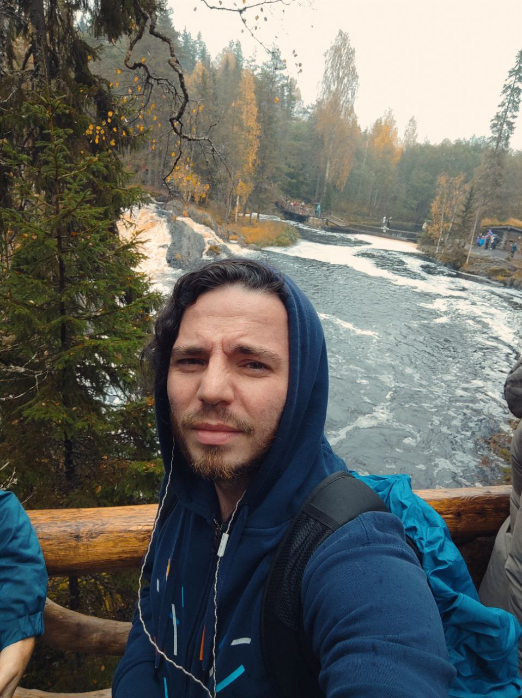

# Vladimir Novichikhin

So, hi! I'm a middle-senior frontend developer with 5+ years of experience, also have knowledge and experience in design, sales, SEO and few other related areas. Worked in freelance, startups, fintech and telecom.

## Skills
+ CSS and preprocessors (SCSS, modules, CSS-in-JS), responsive design
+ React
+ Webpack/Rollup
+ Page speed optimization (from simple websites to applications)

## Looking for a remote job
+ Live in Russia, Saint Petersburg
+ Salary starts from $4500 per month

## Pet-projects
Later here will be links to pet-projects I'd like to show to someone besides close friends and my cat